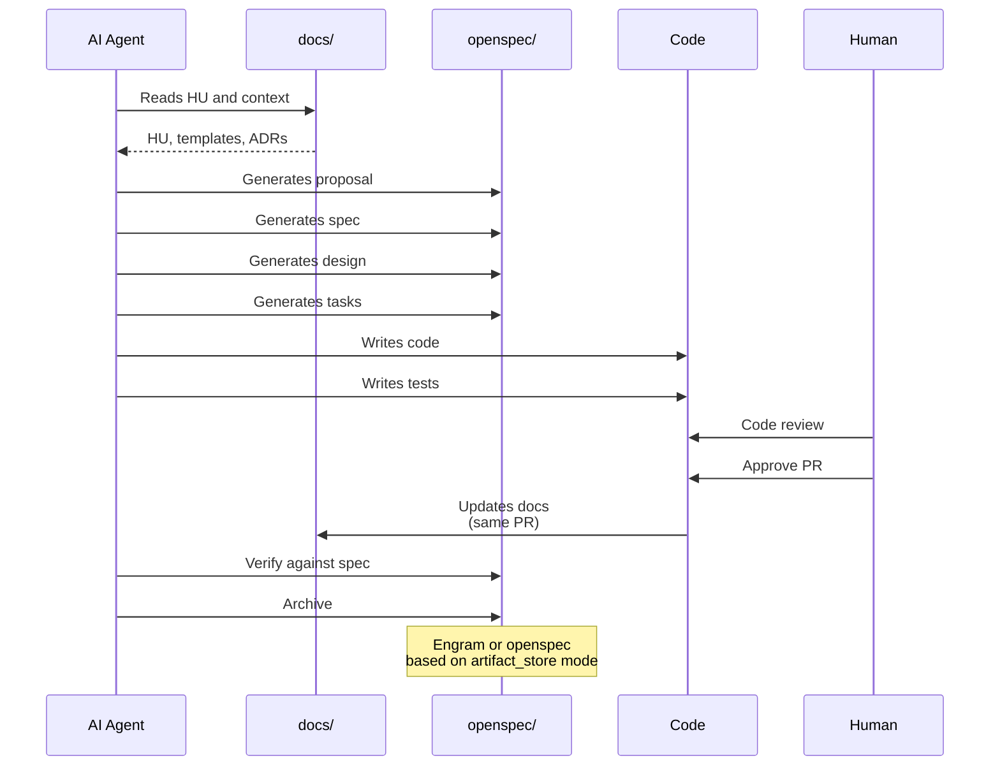
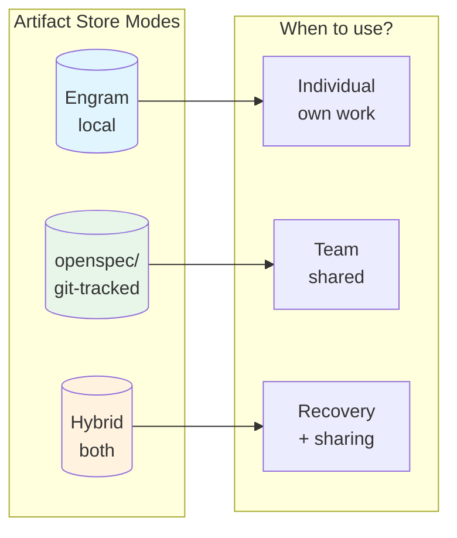
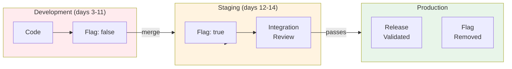
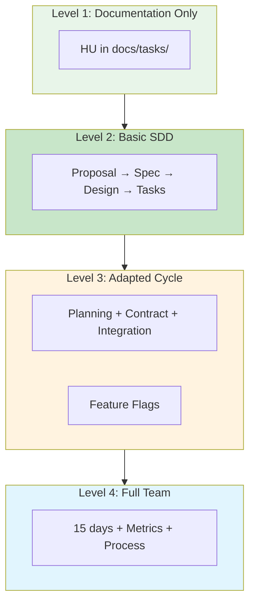

# Framework Architecture — Diagrams

> This document contains diagrams showing how the framework works.

---

## Diagram 1: General Architecture

```mermaid
graph TB
    subgraph HUMANOS["👥 HUMANS / AGENTS"]
        Human[Human]
        Agent[AI Agent<br/>OpenCode / Antigravity / ClaudeCode]
    end

    subgraph DOCS["📁 docs/ (Source of Truth)"]
        PRD[PRD.md]
        DOCS_ADRs[architecture/adr/]
        DOCS_RFCs[architecture/rfc/]
        DOCS_API[api/]
        DOCS_DB[database/]
        DOCS_TASKS[tasks/]
        DOCS_TEMPLATES[templates/]
        DOCS_OTHERS[legacy, FAQ, walkthrough, etc.]
    end

    subgraph OPENSPEC["📦 openspec/ (SDD Artifacts)"]
        CHANGE[changes/{name}/]
        PROPOSAL[001-proposal.md]
        SPEC[002-spec.md]
        DESIGN[003-design.md]
        TASKS[004-tasks.md]
        VERIFY[005-verify.md]
        ARCHIVE[006-archive.md]
    end

    subgraph STORAGE["💾 Persistence"]
        ENGRAM[(Engram<br/>local memory)]
        GIT[(Git<br/>git-tracked)]
    end

    subgraph CODE["💻 Code"]
        SRC[src/]
        TESTS[tests/]
    end

    Human -->|reads| DOCS_TASKS
    Agent -->|reads| DOCS
    Agent -->|generates| OPENSPEC
    Agent -->|writes| CODE
    
    CODE -->|same PR| DOCS
    
    OPENSPEC -->|saves to| STORAGE
    DOCS -->|versions in| GIT
    
    CHANGE --> PROPOSAL
    CHANGE --> SPEC
    CHANGE --> DESIGN
    CHANGE --> TASKS
    CHANGE --> VERIFY
    CHANGE --> ARCHIVE

    style HUMANOS fill:#e1f5fe
    style DOCS fill:#fff3e0
    style OPENSPEC fill:#e8f5e9
    style STORAGE fill:#f3e5f5
    style CODE fill:#ffebee
```

### Description

- **HUMANS / AGENTS**: Humans work with AI agents (OpenCode, Antigravity, ClaudeCode, etc.)
- **docs/**: The source of truth where all documentation lives
- **openspec/**: The artifacts generated by the SDD cycle
- **STORAGE**: How artifacts are persisted (local Engram or git-tracked)
- **CODE**: The code implemented following the specs

---

## Diagram 2: SDD Cycle

```mermaid
graph LR
    subgraph PLANNING["📋 Planning"]
        HU[HU in docs/tasks/]
        CONTRACT[Contract<br/>owner, deadline]
    end

    subgraph SDD["🔄 SDD Cycle"]
        PROPOSAL[Proposal<br/>intent, scope]
        SPEC[Spec<br/>Must/Should, GWT]
        DESIGN[Design<br/>architecture, API]
        TASKS[Tasks<br/>checklist]
    end

    subgraph WORK["💻 Work"]
        CODE[Code]
        TESTS[Tests >80%]
        PR[PR + Review]
    end

    subgraph FINISH["✅ Finish"]
        VERIFY[Verify<br/>spec vs code]
        ARCHIVE[Archive<br/>delta to main]
    end

    HU --> CONTRACT
    CONTRACT --> PROPOSAL
    PROPOSAL --> SPEC
    SPEC --> DESIGN
    DESIGN --> TASKS
    TASKS --> CODE
    CODE --> TESTS
    TESTS --> PR
    PR --> VERIFY
    VERIFY --> ARCHIVE

    style PLANNING fill:#e1f5fe
    style SDD fill:#fff3e0
    style WORK fill:#ffebee
    style FINISH fill:#e8f5e9
```



### Description

1. **Planning**: HU is created and contract is defined (owner, deadline)
2. **SDD Cycle**: Proposal → Spec → Design → Tasks
3. **Work**: Code, tests are written, and PR is opened with review
4. **Finish**: Verified against specs and archived

---

## Diagram 3: Agent + docs Integration



### Description

1. Agent reads from `docs/` to understand context
2. Generates artifacts in `openspec/` (proposal, spec, design, tasks)
3. Writes code and tests
4. Human does code review and approves
5. Code updates docs in the same PR
6. Agent verifies against specs and archives

---

## Diagram 4: docs/ Structure

```mermaid
graph TD
    ROOT[📁 docs/]
    
    ROOT --> PRD[📄 PRD.md]
    ROOT --> CHANGELOG[📄 CHANGELOG.md]
    
    ROOT --> ARCH[📁 architecture/]
    ARCH --> RFC[📁 rfc/]
    ARCH --> ADR[📁 adr/]
    RFC --> RFC_001[RFC-001<br/>docs-structure]
    RFC --> RFC_002[RFC-002<br/>15-day-cycle]
    RFC --> RFC_003[RFC-003<br/>feature-flags]
    ADR --> ADR_001[ADR-001<br/>engram]
    ADR --> ADR_002[ADR-002<br/>docs-source]
    ADR --> ADR_003[ADR-003<br/>cycle]
    ADR --> ADR_004[ADR-004<br/>flags]
    ADR --> ADR_005[ADR-005<br/>org-hu]
    ADR --> ADR_006[ADR-006<br/>architectures]
    ADR --> ADR_007[ADR-007<br/>templates]
    
    ROOT --> API[📁 api/]
    API --> API_EP[endpoints.md]
    API --> API_MOD[models.md]
    
    ROOT --> DB[📁 database/]
    DB --> DB_SCHEMA[schema.md]
    
    ROOT --> TASKS[📁 tasks/]
    TASKS --> RANGE[HU-001-HU-099/]
    RANGE --> HU_001[HU-001<br/>onboarding]
    RANGE --> HU_002[HU-002<br/>validation]
    
    ROOT --> TEMPLATES[📁 templates/]
    TEMPLATES --> TEMPLATE_GUIDE[TEMPLATE_GUIDE.md]
    TEMPLATES --> TEMPLATE_US[user-stories/]
    TEMPLATES --> TEMPLATE_BF[bug-fixes/]
    TEMPLATES --> TEMPLATE_REF[refactors/]
    TEMPLATES --> TEMPLATE_ARCH[architecture/]
    TEMPLATES --> TEMPLATE_DB[database/]
    TEMPLATES --> TEMPLATE_API[api/]
    TEMPLATES --> TEMPLATE_PRD[PRD/]

    ROOT --> OTHER[📄 legacy-migration.md<br/>📄 troubleshooting.md<br/>📄 adoption-guide.md<br/>📄 FAQ.md<br/>📄 anti-patterns.md<br/>📄 walkthrough-hu-login.md]

    style ROOT fill:#fff3e0
    style TEMPLATES fill:#e8f5e9
    style ARCH fill:#e1f5fe
```



### Description

- **docs/** is the source of truth
- **architecture/** contains RFCs (in discussion) and ADRs (approved)
- **templates/** contains all templates organized by type
- **tasks/** has HUs organized by range of 100

---

## Diagram 5: Artifact Store Modes



### Description

| Mode | When to use | Shareable |
|------|-------------|-------------|
| **Engram** | Individual work | ❌ |
| **openspec** | Teams (git-tracked) | ✅ |
| **Hybrid** | Individual + recovery | ✅ |

---

## Diagram 6: Feature Flags Flow



### Description

1. Code is developed with flag in `false`
2. Merged to `dev` without breaking anything
3. In staging, the flag is activated for integration review
4. If it passes, it's activated in production
5. Post-release, the flag is REMOVED (no debt left)

---

## Diagram 7: Adoption Levels



### Description

| Level | What it includes | Ideal for |
|-------|------------|-------------|
| **1** | docs/HU only | Start documenting |
| **2** | Basic SDD cycle | 1-2 people |
| **3** | Cycle + planning + flags | Small teams |
| **4** | 15 days + metrics | Teams of 4+ |

---

## Summary

These diagrams show:

| Diagram | What it answers |
|----------|--------------|
| General Architecture | How does everything fit together? |
| SDD Cycle | What are the phases? |
| Agent Integration | How does the agent interact with docs? |
| docs/ Structure | Where is each thing? |
| Artifact Store | Where are artifacts stored? |
| Feature Flags | How do flags work? |
| Adoption Levels | Where do I start? |

---

## See also

- [adoption-guide.md](adoption-guide.md) - Adoption guide by levels
- [TEMPLATE_GUIDE.md](templates/TEMPLATE_GUIDE.md) - Templates guide
- [Workflow Cycle](./flowdoc-ciclo.md) - Workflow cycle