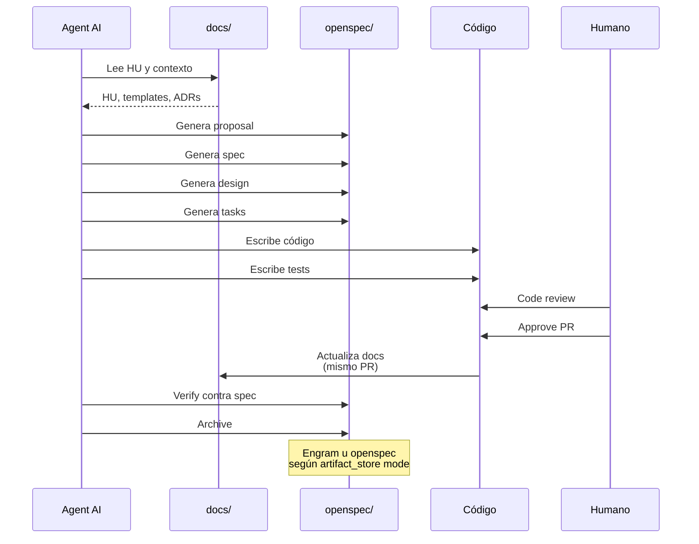
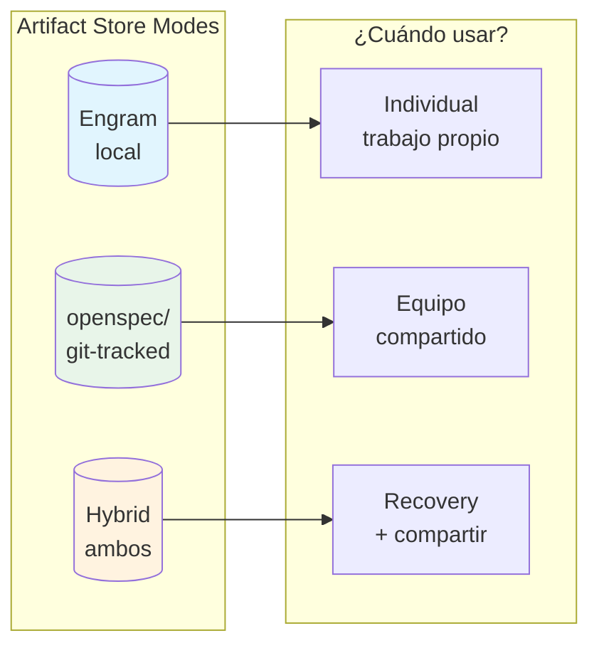
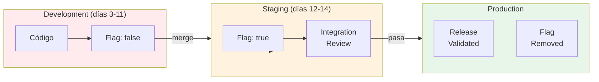
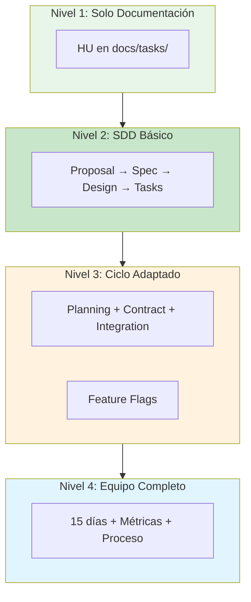

# Arquitectura del Framework — Diagramas

> Este documento contiene los diagramas que muestran cómo funciona el framework.

---

## Diagrama 1: Arquitectura General

```mermaid
graph TB
    subgraph HUMANOS["👥 HUMANOS / AGENTS"]
        Human[Humano]
        Agent[Agent AI<br/>OpenCode / Antigravity / ClaudeCode]
    end

    subgraph DOCS["📁 docs/ (Source of Truth)"]
        PRD[PRD.md]
        DOCS_ADRs[architecture/adr/]
        DOCS_RFCs[architecture/rfc/]
        DOCS_API[api/]
        DOCS_DB[database/]
        DOCS_TASKS[tasks/]
        DOCS_TEMPLATES[templates/]
        DOCS_OTHERS[legacy, FAQ, walkthrough, etc.]
    end

    subgraph OPENSPEC["📦 openspec/ (Artifacts SDD)"]
        CHANGE[changes/{name}/]
        PROPOSAL[001-proposal.md]
        SPEC[002-spec.md]
        DESIGN[003-design.md]
        TASKS[004-tasks.md]
        VERIFY[005-verify.md]
        ARCHIVE[006-archive.md]
    end

    subgraph STORAGE["💾 Persistencia"]
        ENGRAM[(Engram<br/>memoria local)]
        GIT[(Git<br/>git-tracked)]
    end

    subgraph CODE["💻 Código"]
        SRC[src/]
        TESTS[tests/]
    end

    Human -->|lee| DOCS_TASKS
    Agent -->|lee| DOCS
    Agent -->|genera| OPENSPEC
    Agent -->|escribe| CODE
    
    CODE -->|mismo PR| DOCS
    
    OPENSPEC -->|guarda en| STORAGE
    DOCS -->|versiona en| GIT
    
    CHANGE --> PROPOSAL
    CHANGE --> SPEC
    CHANGE --> DESIGN
    CHANGE --> TASKS
    CHANGE --> VERIFY
    CHANGE --> ARCHIVE

    style HUMANOS fill:#e1f5fe
    style DOCS fill:#fff3e0
    style OPENSPEC fill:#e8f5e9
    style STORAGE fill:#f3e5f5
    style CODE fill:#ffebee
```

### Descripción

- **HUMANOS / AGENTS**: Los humanos trabajan con agents de IA (OpenCode, Antigravity, ClaudeCode, etc.)
- **docs/**: El source of truth donde vive toda la documentación
- **openspec/**: Los artifacts generados por el ciclo SDD
- **STORAGE**: Cómo se persisten los artifacts (Engram local o git-tracked)
- **CODE**: El código implementado siguiendo las specs

---

## Diagrama 2: Ciclo SDD

```mermaid
graph LR
    subgraph PLANNING["📋 Planning"]
        HU[HU en docs/tasks/]
        CONTRACT[Contract<br/>owner, deadline]
    end

    subgraph SDD["🔄 SDD Cycle"]
        PROPOSAL[Proposal<br/>intent, scope]
        SPEC[Spec<br/>Must/Should, GWT]
        DESIGN[Design<br/>architecture, API]
        TASKS[Tasks<br/>checklist]
    end

    subgraph WORK["💻 Trabajo"]
        CODE[Código]
        TESTS[Tests >80%]
        PR[PR + Review]
    end

    subgraph FINISH["✅ Finish"]
        VERIFY[Verify<br/>spec vs code]
        ARCHIVE[Archive<br/>delta to main]
    end

    HU --> CONTRACT
    CONTRACT --> PROPOSAL
    PROPOSAL --> SPEC
    SPEC --> DESIGN
    DESIGN --> TASKS
    TASKS --> CODE
    CODE --> TESTS
    TESTS --> PR
    PR --> VERIFY
    VERIFY --> ARCHIVE

    style PLANNING fill:#e1f5fe
    style SDD fill:#fff3e0
    style WORK fill:#ffebee
    style FINISH fill:#e8f5e9
```



### Descripción

1. **Planning**: Se crea la HU y se define el contract (owner, deadline)
2. **SDD Cycle**: Proposal → Spec → Design → Tasks
3. **Trabajo**: Se escribe código, tests, y se abre PR con review
4. **Finish**: Se verifica contra specs y se archiva

---

## Diagrama 3: Integración Agent + docs



### Descripción

1. El agent lee de `docs/` para entender contexto
2. Genera artifacts en `openspec/` (proposal, spec, design, tasks)
3. Escribe código y tests
4. El humano hace code review y approve
5. El código actualiza docs en el mismo PR
6. El agent verifica contra specs y archiva

---

## Diagrama 4: Estructura de docs/

```mermaid
graph TD
    ROOT[📁 docs/]
    
    ROOT --> PRD[📄 PRD.md]
    ROOT --> CHANGELOG[📄 CHANGELOG.md]
    
    ROOT --> ARCH[📁 architecture/]
    ARCH --> RFC[📁 rfc/]
    ARCH --> ADR[📁 adr/]
    RFC --> RFC_001[RFC-001<br/>estructura-docs]
    RFC --> RFC_002[RFC-002<br/>ciclo-15-dias]
    RFC --> RFC_003[RFC-003<br/>feature-flags]
    ADR --> ADR_001[ADR-001<br/>engram]
    ADR --> ADR_002[ADR-002<br/>docs-source]
    ADR --> ADR_003[ADR-003<br/>ciclo]
    ADR --> ADR_004[ADR-004<br/>flags]
    ADR --> ADR_005[ADR-005<br/>org-hu]
    ADR --> ADR_006[ADR-006<br/>arquitecturas]
    ADR --> ADR_007[ADR-007<br/>templates]
    
    ROOT --> API[📁 api/]
    API --> API_EP[endpoints.md]
    API --> API_MOD[modelos.md]
    
    ROOT --> DB[📁 database/]
    DB --> DB_SCHEMA[schema.md]
    
    ROOT --> TASKS[📁 tasks/]
    TASKS --> RANGE[HU-001-HU-099/]
    RANGE --> HU_001[HU-001<br/>onboarding]
    RANGE --> HU_002[HU-002<br/>validacion]
    
    ROOT --> TEMPLATES[📁 templates/]
    TEMPLATES --> TEMPLATE_GUIDE[TEMPLATE_GUIDE.md]
    TEMPLATES --> TEMPLATE_US[user-stories/]
    TEMPLATES --> TEMPLATE_BF[bug-fixes/]
    TEMPLATES --> TEMPLATE_REF[refactors/]
    TEMPLATES --> TEMPLATE_ARCH[architecture/]
    TEMPLATES --> TEMPLATE_DB[database/]
    TEMPLATES --> TEMPLATE_API[api/]
    TEMPLATES --> TEMPLATE_PRD[PRD/]

    ROOT --> OTHER[📄 legacy-migration.md<br/>📄 troubleshooting.md<br/>📄 adoption-guide.md<br/>📄 FAQ.md<br/>📄 anti-patrones.md<br/>📄 walkthrough-hu-login.md]

    style ROOT fill:#fff3e0
    style TEMPLATES fill:#e8f5e9
    style ARCH fill:#e1f5fe
```



### Descripción

- **docs/** es el source of truth
- **architecture/** contiene RFCs (en discusión) y ADRs (aprobados)
- **templates/** contiene todos los templates organizados por tipo
- **tasks/** tiene las HUs organizadas por rango de 100

---

## Diagrama 5: Artifact Store Modes



### Descripción

| Mode | Cuándo usar | Compartible |
|------|-------------|-------------|
| **Engram** | Trabajo individual | ❌ |
| **openspec** | Equipos (git-tracked) | ✅ |
| **Hybrid** | Individual + recovery | ✅ |

---

## Diagrama 6: Feature Flags Flow



### Descripción

1. El código se developea con flag en `false`
2. Se mergea a `dev` sin romper nada
3. En staging, el flag se activa para integration review
4. Si pasa, se activa en production
5. Post-release, el flag se REMUEVE (no dejar deuda)

---

## Diagrama 7: Niveles de Adopción



### Descripción

| Nivel | Qué incluye | Ideal para |
|-------|------------|-------------|
| **1** | Solo docs/HU | Empezar a documentar |
| **2** | Ciclo SDD básico | 1-2 personas |
| **3** | Ciclo + planning + flags | Equipos pequeños |
| **4** | 15 días + métricas | Equipos de 4+ |

---

## Resumen

Estos diagramas muestran:

| Diagrama | Qué responde |
|----------|--------------|
| Arquitectura General | ¿Cómo encaja todo? |
| Ciclo SDD | ¿Cuáles son las fases? |
| Integración Agent | ¿Cómo interactúa el agent con docs? |
| Estructura docs/ | ¿Dónde está cada cosa? |
| Artifact Store | ¿Dónde se guardan los artifacts? |
| Feature Flags | ¿Cómo funcionan los flags? |
| Niveles de Adopción | ¿Por dónde empiezo? |

---

## Ver también

- [adoption-guide.md](adoption-guide.md) - Guía de adopción en niveles
- [TEMPLATE_GUIDE.md](templates/TEMPLATE_GUIDE.md) - Guía de templates
- [framework-coordinacion.md](../framework-coordinacion.md) - Ciclo de trabajo